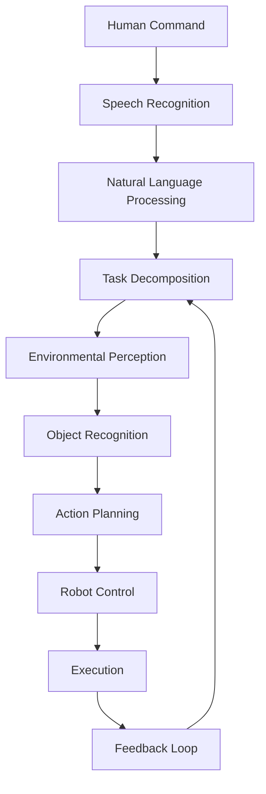

import Tabs from '@theme/Tabs';
import TabItem from '@theme/TabItem';

# Chapter 1: Vision-Language-Action Systems

## Learning Goals
- Understand the fundamentals of Vision-Language-Action (VLA) systems in robotics
- Learn how perception, language, and action integrate in embodied intelligence
- Explore the architecture of VLA systems for humanoid robots

## Introduction to Vision-Language-Action Systems

Vision-Language-Action (VLA) systems represent a paradigm shift in robotics, where robots can perceive their environment, understand natural language commands, and execute complex actions autonomously. These systems form the cognitive and decision-making layer that enables natural human-robot interaction.

### What is VLA in Robotics?

Vision-Language-Action systems integrate three critical components:

1. **Vision**: Environmental perception and object recognition
2. **Language**: Natural language understanding and processing
3. **Action**: Motor control and task execution

Together, these components enable robots to understand and respond to human commands in real-world environments.

### The VLA Pipeline

The VLA pipeline follows a structured flow:

```
Human Command → Language Understanding → Vision Processing → Action Planning → Execution
```

Each stage builds upon the previous one, creating a seamless flow from perception to action.

### VLA in Embodied Intelligence

Embodied intelligence refers to the integration of cognitive capabilities with physical form. In VLA systems, this means:

- **Perception-Action Coupling**: Vision and action are tightly integrated
- **Contextual Understanding**: Language processing considers environmental context
- **Adaptive Behavior**: Actions adapt based on real-time perception

## Architecture of VLA Systems

### Core Components

A typical VLA system consists of:



### Vision Component

The vision component handles environmental perception:

```python
class VisionSystem:
    def __init__(self):
        self.object_detector = ObjectDetectionModel()
        self.scene_analyzer = SceneUnderstandingModel()
        self.spatial_reasoner = SpatialReasoningEngine()

    def process_environment(self, image):
        objects = self.object_detector.detect(image)
        scene_context = self.scene_analyzer.analyze(image)
        spatial_relations = self.spatial_reasoner.reason(objects, scene_context)
        return {
            'objects': objects,
            'context': scene_context,
            'relations': spatial_relations
        }
```

### Language Component

The language component processes natural language commands:

```python
class LanguageSystem:
    def __init__(self):
        self.nlp_model = LanguageUnderstandingModel()
        self.intent_classifier = IntentClassificationEngine()
        self.action_mapper = ActionMappingEngine()

    def process_command(self, command):
        intent = self.intent_classifier.classify(command)
        action_plan = self.action_mapper.map_to_actions(intent)
        return {
            'intent': intent,
            'action_plan': action_plan
        }
```

### Action Component

The action component executes planned tasks:

```python
class ActionSystem:
    def __init__(self):
        self.planner = MotionPlanner()
        self.executor = ActionExecutor()
        self.monitor = ExecutionMonitor()

    def execute_plan(self, plan, environment):
        for action in plan:
            if self.planner.is_feasible(action, environment):
                result = self.executor.execute(action)
                self.monitor.update(result)
                if not result.success:
                    return self.handle_failure(action, result)
        return {'status': 'completed'}
```

## Integration Patterns

### Sequential Integration

In sequential integration, components operate in a linear pipeline:

```python
def sequential_vla_pipeline(command, environment):
    # Step 1: Process language
    language_result = language_system.process_command(command)

    # Step 2: Process vision
    vision_result = vision_system.process_environment(environment)

    # Step 3: Execute action
    action_result = action_system.execute_plan(
        language_result['action_plan'],
        vision_result
    )

    return action_result
```

### Parallel Integration

In parallel integration, components operate simultaneously with feedback:

```python
def parallel_vla_pipeline(command, environment):
    # Process language and vision concurrently
    language_future = executor.submit(language_system.process_command, command)
    vision_future = executor.submit(vision_system.process_environment, environment)

    # Wait for results
    language_result = language_future.result()
    vision_result = vision_future.result()

    # Integrate results and execute
    integrated_plan = integrate_results(language_result, vision_result)
    action_result = action_system.execute_plan(integrated_plan, vision_result)

    return action_result
```

## Real-World Applications

### Service Robotics

VLA systems enable service robots to:
- Understand natural language requests
- Navigate complex environments
- Manipulate objects safely

### Industrial Automation

In industrial settings, VLA systems allow:
- Human-robot collaboration
- Flexible task execution
- Adaptive responses to environmental changes

### Assistive Robotics

For assistive applications, VLA systems provide:
- Natural interaction interfaces
- Context-aware assistance
- Safe human-robot interaction

## Challenges and Considerations

### Safety and Reliability

VLA systems must ensure:
- Safe interaction with humans
- Reliable perception in diverse environments
- Robust language understanding

### Computational Requirements

Considerations include:
- Real-time processing capabilities
- Efficient resource utilization
- Scalable architecture design

## Summary

Vision-Language-Action systems form the foundation for intelligent human-robot interaction. By integrating perception, language, and action, these systems enable robots to understand and respond to human commands in natural, intuitive ways. The next chapter will explore how to build voice-to-action interfaces using speech recognition technologies.