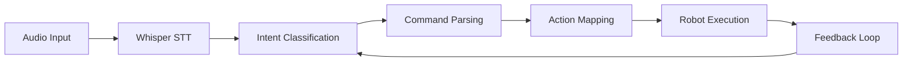

import Tabs from '@theme/Tabs';
import TabItem from '@theme/TabItem';

# Chapter 2: Voice-to-Action Interfaces

## Learning Goals
- Implement speech-to-text conversion using OpenAI Whisper
- Map voice commands to robot intents and actions
- Integrate speech input with ROS 2 for robot control

## Introduction to Voice-to-Action Systems

Voice-to-action interfaces enable robots to understand and respond to spoken commands, creating natural and intuitive human-robot interaction. These systems bridge the gap between human language and robotic action execution.

### Core Components of Voice-to-Action

A voice-to-action system typically includes:
1. **Speech Recognition**: Converting voice to text
2. **Intent Classification**: Understanding command intent
3. **Action Mapping**: Translating intent to robot actions
4. **Execution**: Carrying out the mapped actions

## Using OpenAI Whisper for Speech-to-Text

OpenAI Whisper is a state-of-the-art speech recognition model that can accurately convert speech to text. It's particularly well-suited for robotics applications due to its robustness across different accents and environments.

### Whisper Integration

```python
import whisper
import rospy
from std_msgs.msg import String
from audio_common_msgs.msg import AudioData

class WhisperSTTNode:
    def __init__(self):
        rospy.init_node('whisper_stt_node')

        # Load Whisper model
        self.model = whisper.load_model("base")

        # Audio input subscriber
        self.audio_sub = rospy.Subscriber('/audio', AudioData, self.audio_callback)

        # Text output publisher
        self.text_pub = rospy.Publisher('/stt_output', String, queue_size=10)

        # Status publisher
        self.status_pub = rospy.Publisher('/stt_status', String, queue_size=10)

    def audio_callback(self, audio_data):
        # Convert audio data to numpy array
        audio_array = self.convert_audio_data_to_array(audio_data)

        # Transcribe audio using Whisper
        result = self.model.transcribe(audio_array)
        text = result['text']

        # Publish transcribed text
        text_msg = String()
        text_msg.data = text
        self.text_pub.publish(text_msg)

        # Log the transcription
        rospy.loginfo(f"Transcribed: {text}")

    def convert_audio_data_to_array(self, audio_data):
        # Convert ROS AudioData message to numpy array
        import numpy as np
        import io

        # Convert audio data to appropriate format for Whisper
        audio_bytes = bytes(audio_data.data)
        # Process audio bytes appropriately for Whisper input
        # This is a simplified example - actual implementation may vary
        audio_array = np.frombuffer(audio_bytes, dtype=np.int16).astype(np.float32) / 32768.0
        return audio_array

    def run(self):
        rospy.spin()

if __name__ == '__main__':
    stt_node = WhisperSTTNode()
    stt_node.run()
```

### Whisper Model Selection

Different Whisper models offer trade-offs between accuracy and speed:

<Tabs>
  <TabItem value="tiny" label="Tiny">
    ```python
    # Fastest model, suitable for real-time applications
    model = whisper.load_model("tiny")
    # Good for simple commands with limited vocabulary
    ```
  </TabItem>
  <TabItem value="base" label="Base">
    ```python
    # Balanced model, good for most applications
    model = whisper.load_model("base")
    # Recommended for general use in robotics
    ```
  </TabItem>
  <TabItem value="small" label="Small">
    ```python
    # Higher accuracy, slower processing
    model = whisper.load_model("small")
    # Good for complex commands and noisy environments
    ```
  </TabItem>
</Tabs>

## Mapping Voice Commands to Robot Intents

Once speech is converted to text, the system must classify the intent and map it to appropriate robot actions.

### Intent Classification Pipeline

```python
import re
from typing import Dict, List, Tuple

class IntentClassifier:
    def __init__(self):
        # Define command patterns
        self.command_patterns = {
            'navigation': [
                r'move to (.+)',
                r'go to (.+)',
                r'navigate to (.+)',
                r'go (.+)',
                r'move (.+)'
            ],
            'manipulation': [
                r'pick up (.+)',
                r'grab (.+)',
                r'take (.+)',
                r'get (.+)',
                r'lift (.+)'
            ],
            'action': [
                r'stop',
                r'wait',
                r'continue',
                r'start',
                r'pause'
            ]
        }

    def classify_intent(self, text: str) -> Tuple[str, Dict]:
        text = text.lower().strip()

        for intent_type, patterns in self.command_patterns.items():
            for pattern in patterns:
                match = re.search(pattern, text)
                if match:
                    return intent_type, {'parameters': match.groups(), 'original_text': text}

        return 'unknown', {'original_text': text}

# Example usage
classifier = IntentClassifier()
intent, params = classifier.classify_intent("Please go to the kitchen")
print(f"Intent: {intent}, Parameters: {params}")
```

### Command Parser

```python
class CommandParser:
    def __init__(self):
        self.intent_classifier = IntentClassifier()

    def parse_command(self, text: str):
        intent, params = self.intent_classifier.classify_intent(text)

        if intent == 'navigation':
            return self.parse_navigation_command(params)
        elif intent == 'manipulation':
            return self.parse_manipulation_command(params)
        elif intent == 'action':
            return self.parse_action_command(params)
        else:
            return {'type': 'unknown', 'command': text}

    def parse_navigation_command(self, params):
        location = params['parameters'][0] if params['parameters'] else None
        return {
            'type': 'navigation',
            'location': location,
            'command': params['original_text']
        }

    def parse_manipulation_command(self, params):
        object_name = params['parameters'][0] if params['parameters'] else None
        return {
            'type': 'manipulation',
            'object': object_name,
            'command': params['original_text']
        }

    def parse_action_command(self, params):
        action = params['original_text']
        return {
            'type': 'action',
            'action': action,
            'command': params['original_text']
        }
```

## Integrating Speech Input with ROS 2

ROS 2 provides the framework for integrating speech input with robot control systems.

### ROS 2 Voice Command Node

```python
import rclpy
from rclpy.node import Node
from std_msgs.msg import String
from geometry_msgs.msg import PoseStamped
from sensor_msgs.msg import Image
import json

class VoiceCommandNode(Node):
    def __init__(self):
        super().__init__('voice_command_node')

        # Subscribers
        self.stt_sub = self.create_subscription(
            String,
            '/stt_output',
            self.stt_callback,
            10
        )

        # Publishers
        self.nav_goal_pub = self.create_publisher(
            PoseStamped,
            '/goal_pose',
            10
        )

        self.action_pub = self.create_publisher(
            String,
            '/robot_action',
            10
        )

        # Command parser
        self.command_parser = CommandParser()

        self.get_logger().info('Voice Command Node initialized')

    def stt_callback(self, msg):
        text = msg.data
        self.get_logger().info(f'Received voice command: {text}')

        # Parse the command
        parsed_command = self.command_parser.parse_command(text)

        # Execute based on command type
        if parsed_command['type'] == 'navigation':
            self.handle_navigation_command(parsed_command)
        elif parsed_command['type'] == 'manipulation':
            self.handle_manipulation_command(parsed_command)
        elif parsed_command['type'] == 'action':
            self.handle_action_command(parsed_command)
        else:
            self.get_logger().warn(f'Unknown command: {text}')

    def handle_navigation_command(self, command):
        location = command.get('location', '')
        if location:
            # Convert location to a specific pose
            pose = self.get_pose_for_location(location)
            if pose:
                self.nav_goal_pub.publish(pose)
                self.get_logger().info(f'Navigating to {location}')
            else:
                self.get_logger().warn(f'Unknown location: {location}')
        else:
            self.get_logger().warn('No location specified in navigation command')

    def handle_manipulation_command(self, command):
        object_name = command.get('object', '')
        if object_name:
            action_msg = String()
            action_msg.data = json.dumps({
                'type': 'manipulation',
                'object': object_name,
                'command': command['command']
            })
            self.action_pub.publish(action_msg)
            self.get_logger().info(f'Trying to manipulate {object_name}')
        else:
            self.get_logger().warn('No object specified in manipulation command')

    def handle_action_command(self, command):
        action_msg = String()
        action_msg.data = json.dumps({
            'type': 'action',
            'action': command['action'],
            'command': command['command']
        })
        self.action_pub.publish(action_msg)
        self.get_logger().info(f'Executing action: {command["action"]}')

    def get_pose_for_location(self, location_name):
        # This would typically look up predefined locations
        locations = {
            'kitchen': self.create_pose(1.0, 2.0, 0.0),
            'living room': self.create_pose(-1.0, 0.0, 0.0),
            'bedroom': self.create_pose(2.0, -1.0, 0.0),
            'office': self.create_pose(0.0, -2.0, 0.0)
        }

        if location_name in locations:
            pose = locations[location_name]
            pose_stamped = PoseStamped()
            pose_stamped.header.stamp = self.get_clock().now().to_msg()
            pose_stamped.header.frame_id = 'map'
            pose_stamped.pose = pose
            return pose_stamped
        else:
            return None

    def create_pose(self, x, y, theta):
        from geometry_msgs.msg import Pose
        import math
        pose = Pose()
        pose.position.x = x
        pose.position.y = y
        pose.position.z = 0.0
        pose.orientation.z = math.sin(theta / 2.0)
        pose.orientation.w = math.cos(theta / 2.0)
        return pose

def main(args=None):
    rclpy.init(args=args)
    voice_command_node = VoiceCommandNode()

    try:
        rclpy.spin(voice_command_node)
    except KeyboardInterrupt:
        pass
    finally:
        voice_command_node.destroy_node()
        rclpy.shutdown()

if __name__ == '__main__':
    main()
```

## Voice Command Processing Pipeline

### Complete Pipeline Architecture

The complete voice-to-action pipeline involves multiple processing stages:



### Audio Preprocessing

For optimal Whisper performance, audio preprocessing is crucial:

```python
import numpy as np
from scipy import signal

class AudioPreprocessor:
    def __init__(self):
        self.sample_rate = 16000  # Whisper expects 16kHz
        self.frame_duration = 0.1  # 100ms frames

    def preprocess_audio(self, audio_data, original_sample_rate):
        # Resample to 16kHz if needed
        if original_sample_rate != self.sample_rate:
            num_samples = int(len(audio_data) * self.sample_rate / original_sample_rate)
            audio_data = signal.resample(audio_data, num_samples)

        # Normalize audio
        audio_data = audio_data / np.max(np.abs(audio_data))

        # Apply noise reduction if needed
        audio_data = self.reduce_noise(audio_data)

        return audio_data

    def reduce_noise(self, audio_data):
        # Simple noise reduction using spectral gating
        # This is a simplified example - real implementation would be more sophisticated
        threshold = np.mean(np.abs(audio_data)) * 0.1
        audio_data[np.abs(audio_data) < threshold] = 0
        return audio_data
```

## Handling Ambiguity and Confirmation

Voice commands can be ambiguous, so it's important to handle uncertainty gracefully:

```python
class VoiceCommandHandler:
    def __init__(self):
        self.command_parser = CommandParser()
        self.confidence_threshold = 0.7

    def process_command_with_confirmation(self, text, confidence):
        if confidence < self.confidence_threshold:
            # Request clarification
            return self.request_clarification(text)

        parsed_command = self.command_parser.parse_command(text)

        # Check for ambiguous commands
        if self.is_ambiguous(parsed_command):
            return self.request_disambiguation(parsed_command)

        # Execute command
        return self.execute_command(parsed_command)

    def is_ambiguous(self, command):
        # Check if command has ambiguous elements
        if command['type'] == 'navigation':
            # Check if location is ambiguous
            return self.is_ambiguous_location(command.get('location', ''))
        elif command['type'] == 'manipulation':
            # Check if object is ambiguous
            return self.is_ambiguous_object(command.get('object', ''))

        return False

    def is_ambiguous_location(self, location):
        # Implement logic to detect ambiguous locations
        ambiguous_terms = ['there', 'over there', 'that place']
        return any(term in location.lower() for term in ambiguous_terms)

    def is_ambiguous_object(self, obj_name):
        # Implement logic to detect ambiguous objects
        ambiguous_terms = ['that', 'it', 'one', 'thing']
        return any(term in obj_name.lower() for term in ambiguous_terms)

    def request_clarification(self, text):
        # Return a response requesting clarification
        return {
            'type': 'clarification',
            'message': f"I'm not confident I understood: '{text}'. Could you repeat that?",
            'original_command': text
        }

    def request_disambiguation(self, command):
        # Return a response requesting disambiguation
        if command['type'] == 'navigation':
            return {
                'type': 'disambiguation',
                'message': f"Which {command['location']} do you mean?",
                'command': command
            }
        elif command['type'] == 'manipulation':
            return {
                'type': 'disambiguation',
                'message': f"Which {command['object']} do you mean?",
                'command': command
            }
```

## Error Handling and Robustness

### Speech Recognition Error Handling

```python
class RobustSTT:
    def __init__(self):
        self.model = whisper.load_model("base")
        self.retry_count = 3
        self.confidence_threshold = 0.5

    def robust_transcribe(self, audio_data):
        for attempt in range(self.retry_count):
            try:
                result = self.model.transcribe(audio_data)
                text = result['text']
                confidence = self.estimate_confidence(result)

                if confidence >= self.confidence_threshold:
                    return text, confidence
                else:
                    self.get_logger().info(f"Confidence too low ({confidence}), retrying...")

            except Exception as e:
                self.get_logger().error(f"STT failed on attempt {attempt + 1}: {e}")

        return "", 0.0  # Return empty string if all retries fail

    def estimate_confidence(self, result):
        # Estimate confidence based on various factors
        # This is a simplified example - real implementation would be more sophisticated
        text = result.get('text', '')
        if not text.strip():
            return 0.0

        # Simple confidence estimation
        # In practice, this would use more sophisticated methods
        return min(1.0, len(text) / 10.0)  # Basic estimation
```

## Summary

Voice-to-action interfaces provide a natural way for humans to interact with robots. By using OpenAI Whisper for speech recognition and implementing proper intent classification and action mapping, we can create robust systems that understand and respond to spoken commands. The next chapter will explore how to use LLMs to convert natural language into structured action plans for the robot.