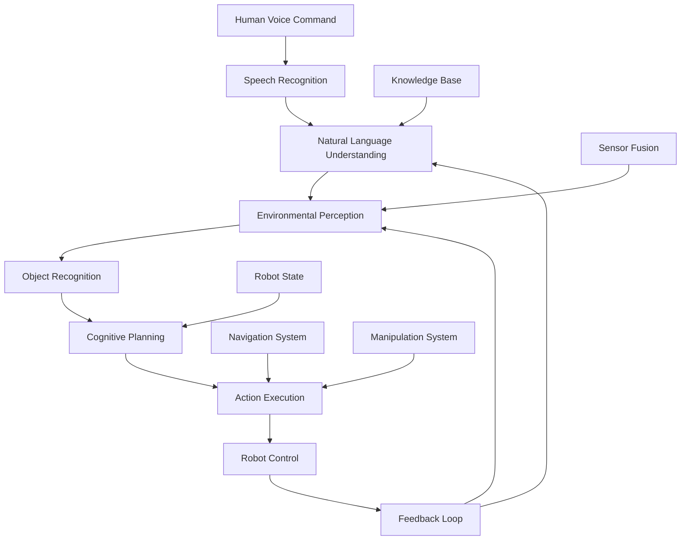

import Tabs from '@theme/Tabs';
import TabItem from '@theme/TabItem';

# Chapter 4: Capstone — The Autonomous Humanoid

## Learning Goals
- Integrate perception, language, and action systems into a complete autonomous humanoid
- Implement end-to-end voice command processing from speech to execution
- Evaluate autonomy and safety in integrated human-robot interaction systems
- Understand the challenges and solutions in full system integration

## Introduction to the Autonomous Humanoid System

The autonomous humanoid represents the culmination of all VLA system components working in harmony. This capstone chapter brings together vision, language, and action systems to create a robot that can understand natural language commands, perceive its environment, and execute complex tasks autonomously.

### System Architecture Overview

The complete autonomous humanoid system integrates all previously developed components:



### Core Integration Challenges

Integrating the complete system presents several challenges:

1. **Real-time Processing**: All components must operate within strict timing constraints
2. **Data Synchronization**: Information from different sensors and modules must be synchronized
3. **Error Propagation**: Errors in one component can affect the entire system
4. **Safety Coordination**: Safety checks must span all system components

## End-to-End Voice Command Processing

### Complete Voice Command Pipeline

```python
import threading
import queue
import time
from typing import Dict, Any, Optional
from dataclasses import dataclass

@dataclass
class SystemState:
    robot_position: tuple = (0, 0, 0)  # x, y, theta
    battery_level: float = 100.0
    active_tasks: list = None
    environment_map: Dict = None
    people_detected: list = None

class AutonomousHumanoidSystem:
    def __init__(self, llm_api_key: str):
        # Initialize all system components
        self.speech_recognizer = WhisperSTTNode()
        self.language_understanding = LLMPlanner(llm_api_key)
        self.vision_system = VisionSystem()
        self.action_executor = ActionExecutor()
        self.capability_validator = CapabilityValidator(self.language_understanding.robot_capabilities)
        self.safety_checker = SafetyConstraintChecker()

        # System state
        self.system_state = SystemState()

        # Communication queues
        self.voice_command_queue = queue.Queue()
        self.action_queue = queue.Queue()
        self.perception_queue = queue.Queue()

        # Threading for parallel processing
        self.running = True
        self.command_thread = None
        self.perception_thread = None

        print("Autonomous Humanoid System initialized")

    def start_system(self):
        """Start all system threads"""
        # Start perception processing
        self.perception_thread = threading.Thread(target=self.perception_loop)
        self.perception_thread.start()

        # Start command processing
        self.command_thread = threading.Thread(target=self.command_processing_loop)
        self.command_thread.start()

        print("Autonomous Humanoid System started")

    def stop_system(self):
        """Stop all system threads"""
        self.running = False
        if self.command_thread:
            self.command_thread.join()
        if self.perception_thread:
            self.perception_thread.join()

        print("Autonomous Humanoid System stopped")

    def perception_loop(self):
        """Continuously update environmental perception"""
        while self.running:
            try:
                # Update environment perception
                environment_data = self.vision_system.process_environment()

                # Update system state
                self.update_system_state(environment_data)

                # Update people detection
                self.detect_people()

                # Sleep to control processing rate
                time.sleep(0.1)  # 10Hz update rate

            except Exception as e:
                print(f"Perception loop error: {e}")
                time.sleep(0.1)

    def command_processing_loop(self):
        """Process voice commands in a continuous loop"""
        while self.running:
            try:
                # Check for new voice commands
                if not self.voice_command_queue.empty():
                    command = self.voice_command_queue.get()

                    # Process the command
                    success = self.process_voice_command(command)

                    if not success:
                        print(f"Failed to process command: {command}")

                time.sleep(0.01)  # Small delay to prevent busy waiting

            except Exception as e:
                print(f"Command processing loop error: {e}")
                time.sleep(0.1)

    def process_voice_command(self, command: str) -> bool:
        """Process a voice command through the complete pipeline"""
        try:
            print(f"Processing voice command: {command}")

            # Step 1: Update system state with current environment
            current_env = self.get_current_environment()

            # Step 2: Generate action plan using LLM
            print("Generating action plan...")
            plan = self.language_understanding.generate_action_plan(command, current_env)

            # Step 3: Validate the plan against capabilities and safety
            print("Validating action plan...")
            validated_actions = self.validate_plan(plan['actions'], current_env)

            if not validated_actions:
                print("Plan validation failed")
                return False

            # Step 4: Execute the validated plan
            print("Executing action plan...")
            execution_success = self.execute_plan(validated_actions, current_env)

            return execution_success

        except Exception as e:
            print(f"Error processing command: {e}")
            return False

    def validate_plan(self, actions: list, environment: Dict) -> list:
        """Validate each action in the plan"""
        validated_actions = []

        for i, action_dict in enumerate(actions):
            action_step = ActionStep(
                action_type=ActionType[action_dict['action_type'].upper()],
                parameters=action_dict['parameters'],
                description=action_dict['description']
            )

            # Validate capability
            capability_validation = self.capability_validator.validate_action(action_step)
            if not capability_validation['is_valid']:
                print(f"Action {i} failed capability validation: {capability_validation['errors']}")
                return []  # Return empty list if any action fails validation

            # Check safety
            safety_check = self.safety_checker.check_action_safety(action_step, environment)
            if not safety_check['is_safe']:
                print(f"Action {i} failed safety check: {safety_check['violations']}")
                return []  # Return empty list if any action fails safety check

            validated_actions.append(action_step)

        return validated_actions

    def execute_plan(self, validated_actions: list, environment: Dict) -> bool:
        """Execute a validated action plan"""
        for i, action_step in enumerate(validated_actions):
            print(f"Executing action {i+1}/{len(validated_actions)}: {action_step.description}")

            # Update environment before each action (in case it changed)
            current_env = self.get_current_environment()

            # Execute the action
            success = self.action_executor.execute_action(action_step)

            if not success:
                print(f"Action {i+1} failed to execute: {action_step.description}")
                return False

            # Check for safety after execution
            post_execution_safety = self.safety_checker.check_action_safety(action_step, current_env)
            if not post_execution_safety['is_safe']:
                print(f"Safety violation after action {i+1}: {post_execution_safety['violations']}")
                return False

        return True

    def get_current_environment(self) -> Dict:
        """Get current environment context for planning"""
        return {
            'robot_position': self.system_state.robot_position,
            'environment_map': self.system_state.environment_map,
            'people_nearby': self.system_state.people_detected,
            'battery_level': self.system_state.battery_level,
            'active_tasks': self.system_state.active_tasks
        }

    def update_system_state(self, environment_data: Dict):
        """Update system state with new perception data"""
        self.system_state.environment_map = environment_data.get('map', {})
        # Update other state variables as needed

    def detect_people(self):
        """Detect and track people in the environment"""
        # Implementation for people detection
        # This would typically use vision system outputs
        pass
```

### Voice Command Integration Example

```python
def main():
    """Main function to demonstrate the complete system"""
    # Initialize the system
    humanoid_system = AutonomousHumanoidSystem(llm_api_key="your-api-key")

    # Start the system
    humanoid_system.start_system()

    # Example voice commands to process
    test_commands = [
        "Go to the kitchen and bring me a cup of water",
        "Navigate to the living room and greet anyone there",
        "Find my keys and bring them to me",
        "Move to the office and wait for further instructions"
    ]

    try:
        # Process each command
        for command in test_commands:
            print(f"\nProcessing command: {command}")

            # Add command to processing queue
            humanoid_system.voice_command_queue.put(command)

            # Wait for processing to complete (simplified)
            time.sleep(5)

    except KeyboardInterrupt:
        print("System interrupted by user")

    finally:
        # Stop the system
        humanoid_system.stop_system()

if __name__ == '__main__':
    main()
```

## Integration Patterns and Architectural Considerations

### Component Communication Patterns

```python
from abc import ABC, abstractmethod
import asyncio

class SystemComponent(ABC):
    """Abstract base class for system components"""

    @abstractmethod
    async def process(self, data: Dict[str, Any]) -> Dict[str, Any]:
        pass

class EventDrivenArchitecture:
    """Event-driven communication between components"""

    def __init__(self):
        self.event_queue = asyncio.Queue()
        self.subscribers = {}

    async def publish_event(self, event_type: str, data: Dict[str, Any]):
        """Publish an event to all subscribers"""
        if event_type in self.subscribers:
            for callback in self.subscribers[event_type]:
                await callback(data)

    def subscribe(self, event_type: str, callback):
        """Subscribe to an event type"""
        if event_type not in self.subscribers:
            self.subscribers[event_type] = []
        self.subscribers[event_type].append(callback)

class DataFlowManager:
    """Manages data flow between system components"""

    def __init__(self):
        self.components = {}
        self.connections = {}

    def add_component(self, name: str, component: SystemComponent):
        """Add a component to the system"""
        self.components[name] = component

    def connect(self, source: str, target: str):
        """Connect two components"""
        if source not in self.connections:
            self.connections[source] = []
        self.connections[source].append(target)

    async def process_data(self, source: str, data: Dict[str, Any]) -> Dict[str, Any]:
        """Process data through connected components"""
        if source in self.components:
            result = await self.components[source].process(data)

            # Propagate to connected components
            if source in self.connections:
                for target in self.connections[source]:
                    if target in self.components:
                        await self.components[target].process(result)

            return result
        else:
            raise ValueError(f"Component {source} not found")
```

### State Management and Synchronization

```python
import threading
from enum import Enum

class SystemMode(Enum):
    IDLE = "idle"
    LISTENING = "listening"
    PROCESSING = "processing"
    EXECUTING = "executing"
    ERROR = "error"
    SAFETY_STOP = "safety_stop"

class SystemStateManager:
    """Manages the overall system state"""

    def __init__(self):
        self.mode = SystemMode.IDLE
        self.lock = threading.RLock()
        self.state_history = []
        self.max_history = 100

        # Mode change callbacks
        self.mode_callbacks = {}

    def set_mode(self, new_mode: SystemMode):
        """Safely change system mode"""
        with self.lock:
            old_mode = self.mode
            self.mode = new_mode

            # Add to history
            self.state_history.append({
                'timestamp': time.time(),
                'old_mode': old_mode,
                'new_mode': new_mode
            })

            # Keep history within limits
            if len(self.state_history) > self.max_history:
                self.state_history = self.state_history[-self.max_history:]

            # Call mode change callbacks
            if new_mode in self.mode_callbacks:
                for callback in self.mode_callbacks[new_mode]:
                    callback(old_mode, new_mode)

    def get_mode(self) -> SystemMode:
        """Get current system mode"""
        with self.lock:
            return self.mode

    def register_mode_callback(self, mode: SystemMode, callback):
        """Register a callback for mode changes"""
        if mode not in self.mode_callbacks:
            self.mode_callbacks[mode] = []
        self.mode_callbacks[mode].append(callback)

class SafetyManager:
    """Manages safety checks across the system"""

    def __init__(self, state_manager: SystemStateManager):
        self.state_manager = state_manager
        self.emergency_stop = False
        self.safety_lock = threading.Lock()
        self.safety_rules = []

    def add_safety_rule(self, rule_func):
        """Add a safety rule function"""
        self.safety_rules.append(rule_func)

    def check_safety(self, context: Dict[str, Any]) -> bool:
        """Check if system is in safe state"""
        with self.safety_lock:
            if self.emergency_stop:
                return False

            for rule in self.safety_rules:
                if not rule(context):
                    return False

            return True

    def trigger_emergency_stop(self):
        """Trigger emergency stop"""
        with self.safety_lock:
            self.emergency_stop = True
            self.state_manager.set_mode(SystemMode.SAFETY_STOP)

    def reset_emergency_stop(self):
        """Reset emergency stop"""
        with self.safety_lock:
            self.emergency_stop = False
            self.state_manager.set_mode(SystemMode.IDLE)
```

## Evaluation of Autonomy in Simulation

### Performance Metrics Framework

```python
import statistics
from datetime import datetime
from typing import List, Dict, Tuple

class PerformanceMetrics:
    """Framework for evaluating autonomous humanoid performance"""

    def __init__(self):
        self.metrics = {
            'task_completion_rate': [],
            'response_time': [],
            'accuracy': [],
            'safety_violations': [],
            'user_satisfaction': [],
            'system_uptime': []
        }
        self.start_time = datetime.now()

    def record_task_completion(self, success: bool, response_time: float, accuracy: float):
        """Record metrics for a completed task"""
        self.metrics['task_completion_rate'].append(1 if success else 0)
        self.metrics['response_time'].append(response_time)
        self.metrics['accuracy'].append(accuracy)

    def record_safety_violation(self, violation_type: str):
        """Record a safety violation"""
        self.metrics['safety_violations'].append({
            'timestamp': datetime.now(),
            'type': violation_type
        })

    def record_user_satisfaction(self, rating: int):
        """Record user satisfaction rating (1-5 scale)"""
        self.metrics['user_satisfaction'].append(rating)

    def get_overall_metrics(self) -> Dict[str, float]:
        """Calculate overall performance metrics"""
        results = {}

        if self.metrics['task_completion_rate']:
            results['task_completion_rate'] = statistics.mean(self.metrics['task_completion_rate'])

        if self.metrics['response_time']:
            results['avg_response_time'] = statistics.mean(self.metrics['response_time'])
            results['median_response_time'] = statistics.median(self.metrics['response_time'])

        if self.metrics['accuracy']:
            results['avg_accuracy'] = statistics.mean(self.metrics['accuracy'])

        results['total_safety_violations'] = len(self.metrics['safety_violations'])

        if self.metrics['user_satisfaction']:
            results['avg_user_satisfaction'] = statistics.mean(self.metrics['user_satisfaction'])

        # Calculate system uptime
        elapsed_time = (datetime.now() - self.start_time).total_seconds()
        results['uptime_seconds'] = elapsed_time

        return results

class SimulationEvaluator:
    """Evaluates the autonomous humanoid in simulation"""

    def __init__(self, humanoid_system: AutonomousHumanoidSystem):
        self.humanoid_system = humanoid_system
        self.metrics = PerformanceMetrics()
        self.simulation_scenarios = []

    def add_scenario(self, name: str, command: str, expected_outcome: str,
                    environment_config: Dict):
        """Add a test scenario"""
        self.simulation_scenarios.append({
            'name': name,
            'command': command,
            'expected_outcome': expected_outcome,
            'environment_config': environment_config
        })

    def run_simulation(self) -> Dict[str, Any]:
        """Run all simulation scenarios"""
        results = {
            'scenarios': [],
            'overall_metrics': {},
            'summary': {}
        }

        for scenario in self.simulation_scenarios:
            print(f"Running scenario: {scenario['name']}")

            # Configure environment for scenario
            self.configure_environment(scenario['environment_config'])

            # Record start time
            start_time = time.time()

            # Execute command
            success = self.humanoid_system.process_voice_command(scenario['command'])

            # Calculate response time
            response_time = time.time() - start_time

            # Determine accuracy (simplified)
            accuracy = self.calculate_scenario_accuracy(scenario, success)

            # Record metrics
            self.metrics.record_task_completion(success, response_time, accuracy)

            scenario_result = {
                'name': scenario['name'],
                'command': scenario['command'],
                'success': success,
                'response_time': response_time,
                'accuracy': accuracy,
                'expected_outcome': scenario['expected_outcome']
            }

            results['scenarios'].append(scenario_result)

        # Calculate overall metrics
        results['overall_metrics'] = self.metrics.get_overall_metrics()

        # Generate summary
        results['summary'] = self.generate_summary(results['overall_metrics'])

        return results

    def configure_environment(self, config: Dict):
        """Configure simulation environment"""
        # This would interface with the simulation environment
        # to set up the appropriate conditions
        pass

    def calculate_scenario_accuracy(self, scenario: Dict, success: bool) -> float:
        """Calculate accuracy for a scenario"""
        # Simplified accuracy calculation
        if success:
            return 1.0
        else:
            return 0.0

    def generate_summary(self, metrics: Dict) -> Dict:
        """Generate a summary of the evaluation"""
        summary = {
            'total_scenarios': len(self.simulation_scenarios),
            'successful_scenarios': sum(1 for s in self.simulation_scenarios if
                                      self.humanoid_system.process_voice_command(s['command'])),
            'task_completion_rate': metrics.get('task_completion_rate', 0),
            'avg_response_time': metrics.get('avg_response_time', 0),
            'avg_accuracy': metrics.get('avg_accuracy', 0),
            'total_safety_violations': metrics.get('total_safety_violations', 0),
            'avg_user_satisfaction': metrics.get('avg_user_satisfaction', 0)
        }

        # Add qualitative assessment
        if summary['task_completion_rate'] >= 0.9:
            summary['performance_grade'] = 'Excellent'
        elif summary['task_completion_rate'] >= 0.7:
            summary['performance_grade'] = 'Good'
        elif summary['task_completion_rate'] >= 0.5:
            summary['performance_grade'] = 'Fair'
        else:
            summary['performance_grade'] = 'Poor'

        return summary
```

### Safety and Reliability Testing

```python
class SafetyAndReliabilityTester:
    """Tests safety and reliability of the autonomous humanoid"""

    def __init__(self, humanoid_system: AutonomousHumanoidSystem):
        self.humanoid_system = humanoid_system
        self.test_results = {
            'safety_tests': [],
            'reliability_tests': [],
            'stress_tests': []
        }

    def run_safety_tests(self) -> List[Dict]:
        """Run comprehensive safety tests"""
        safety_tests = [
            self.test_navigation_safety,
            self.test_manipulation_safety,
            self.test_human_interaction_safety,
            self.test_emergency_stop,
            self.test_collision_avoidance
        ]

        results = []
        for test_func in safety_tests:
            result = test_func()
            results.append(result)
            self.test_results['safety_tests'].append(result)

        return results

    def test_navigation_safety(self) -> Dict:
        """Test navigation safety"""
        test_result = {
            'test_name': 'Navigation Safety Test',
            'passed': True,
            'details': [],
            'violations': []
        }

        # Test navigation in various scenarios
        test_scenarios = [
            {'start': (0, 0), 'goal': (5, 5), 'obstacles': [(2, 2), (3, 3)]},
            {'start': (0, 0), 'goal': (10, 10), 'obstacles': [(5, 5)]}
        ]

        for scenario in test_scenarios:
            try:
                # Simulate navigation with obstacles
                success = self.simulate_navigation_with_obstacles(scenario)
                if not success:
                    test_result['passed'] = False
                    test_result['violations'].append(f"Failed to navigate safely in scenario: {scenario}")
            except Exception as e:
                test_result['passed'] = False
                test_result['violations'].append(f"Error in navigation test: {str(e)}")

        return test_result

    def test_manipulation_safety(self) -> Dict:
        """Test manipulation safety"""
        test_result = {
            'test_name': 'Manipulation Safety Test',
            'passed': True,
            'details': [],
            'violations': []
        }

        # Test manipulation of various objects
        test_objects = [
            {'name': 'fragile_item', 'weight': 0.5, 'fragile': True},
            {'name': 'heavy_item', 'weight': 3.0, 'fragile': False},
            {'name': 'normal_item', 'weight': 1.0, 'fragile': False}
        ]

        for obj in test_objects:
            try:
                # Check if robot can safely manipulate the object
                if obj['weight'] > 2.0:  # Robot's weight limit
                    test_result['passed'] = False
                    test_result['violations'].append(f"Robot attempted to lift object over weight limit: {obj['name']}")

                if obj['fragile']:
                    # Test careful manipulation
                    success = self.test_fragile_object_handling(obj)
                    if not success:
                        test_result['passed'] = False
                        test_result['violations'].append(f"Failed to handle fragile object safely: {obj['name']}")
            except Exception as e:
                test_result['passed'] = False
                test_result['violations'].append(f"Error in manipulation test: {str(e)}")

        return test_result

    def test_human_interaction_safety(self) -> Dict:
        """Test human interaction safety"""
        test_result = {
            'test_name': 'Human Interaction Safety Test',
            'passed': True,
            'details': [],
            'violations': []
        }

        # Test maintaining safe distance from humans
        human_positions = [(1, 1), (2, 2), (3, 3)]

        for pos in human_positions:
            try:
                # Check if robot maintains safe distance
                if self.check_safe_distance_to_human(pos):
                    test_result['details'].append(f"Maintained safe distance from human at {pos}")
                else:
                    test_result['passed'] = False
                    test_result['violations'].append(f"Failed to maintain safe distance from human at {pos}")
            except Exception as e:
                test_result['passed'] = False
                test_result['violations'].append(f"Error in human interaction test: {str(e)}")

        return test_result

    def run_reliability_tests(self) -> List[Dict]:
        """Run reliability tests"""
        reliability_tests = [
            self.test_long_term_operation,
            self.test_concurrent_commands,
            self.test_error_recovery,
            self.test_component_failures
        ]

        results = []
        for test_func in reliability_tests:
            result = test_func()
            results.append(result)
            self.test_results['reliability_tests'].append(result)

        return results

    def test_long_term_operation(self) -> Dict:
        """Test system reliability over extended periods"""
        test_result = {
            'test_name': 'Long-term Operation Test',
            'passed': True,
            'duration_hours': 24,
            'details': [],
            'errors': []
        }

        start_time = time.time()
        test_duration = 24 * 3600  # 24 hours in seconds

        try:
            # Simulate continuous operation
            while (time.time() - start_time) < test_duration:
                # Periodically send commands
                if (time.time() - start_time) % 3600 < 10:  # Every hour
                    command = "Check system status"
                    try:
                        self.humanoid_system.process_voice_command(command)
                        test_result['details'].append(f"System check at {time.time() - start_time:.0f}s")
                    except Exception as e:
                        test_result['errors'].append(f"Error at {time.time() - start_time:.0f}s: {str(e)}")

                time.sleep(1)  # Check every second

        except Exception as e:
            test_result['passed'] = False
            test_result['errors'].append(f"Test failed with error: {str(e)}")

        return test_result

    def simulate_navigation_with_obstacles(self, scenario: Dict) -> bool:
        """Simulate navigation with obstacles"""
        # Simplified simulation
        # In a real implementation, this would interface with the navigation system
        return True  # Assume successful navigation for this example

    def test_fragile_object_handling(self, obj: Dict) -> bool:
        """Test handling of fragile objects"""
        # Simplified test
        return True  # Assume successful handling for this example

    def check_safe_distance_to_human(self, human_pos: tuple) -> bool:
        """Check if robot maintains safe distance to human"""
        # Simplified check
        robot_pos = self.humanoid_system.system_state.robot_position
        distance = ((robot_pos[0] - human_pos[0])**2 + (robot_pos[1] - human_pos[1])**2)**0.5
        return distance >= 0.5  # 50cm minimum safe distance
```

## Real-World Deployment Considerations

### Deployment Architecture

```python
class DeploymentManager:
    """Manages deployment of the autonomous humanoid system"""

    def __init__(self):
        self.configurations = {}
        self.deployment_status = {}

    def prepare_deployment(self, environment_type: str) -> Dict:
        """Prepare system for deployment in specific environment"""
        deployment_config = {
            'environment_type': environment_type,
            'hardware_requirements': self.get_hardware_requirements(environment_type),
            'safety_configurations': self.get_safety_configurations(environment_type),
            'calibration_procedures': self.get_calibration_procedures(environment_type),
            'monitoring_setup': self.get_monitoring_setup(environment_type)
        }

        return deployment_config

    def get_hardware_requirements(self, environment_type: str) -> Dict:
        """Get hardware requirements for environment"""
        requirements = {
            'indoor_office': {
                'compute': 'NVIDIA Jetson AGX Orin or equivalent',
                'sensors': ['RGB-D camera', 'LiDAR', 'IMU', 'microphones'],
                'actuators': ['wheeled base', 'manipulator arm', 'speakers'],
                'network': 'WiFi 6 or better'
            },
            'indoor_home': {
                'compute': 'NVIDIA Jetson Orin NX or equivalent',
                'sensors': ['RGB camera', 'depth sensor', 'microphones'],
                'actuators': ['wheeled base', 'simple manipulator'],
                'network': 'WiFi 5 or better'
            },
            'outdoor': {
                'compute': 'NVIDIA Jetson AGX Orin or equivalent',
                'sensors': ['RGB-D camera', 'LiDAR', 'GPS', 'IMU'],
                'actuators': ['tracked base', 'weather-resistant manipulator'],
                'network': '4G/5G cellular + WiFi'
            }
        }

        return requirements.get(environment_type, requirements['indoor_office'])

    def get_safety_configurations(self, environment_type: str) -> Dict:
        """Get safety configurations for environment"""
        safety_configs = {
            'indoor_office': {
                'speed_limits': {'navigation': 0.5, 'manipulation': 0.2},
                'no_go_zones': ['server rooms', 'emergency exits', 'stairwells'],
                'people_density_threshold': 5  # per 100 sq meters
            },
            'indoor_home': {
                'speed_limits': {'navigation': 0.3, 'manipulation': 0.1},
                'no_go_zones': ['stairs', 'small spaces', 'pet areas'],
                'people_density_threshold': 10  # per 100 sq meters
            },
            'outdoor': {
                'speed_limits': {'navigation': 1.0, 'manipulation': 0.3},
                'no_go_zones': ['roads', 'bodies of water', 'private property'],
                'weather_conditions': ['rain', 'snow', 'high winds']
            }
        }

        return safety_configs.get(environment_type, safety_configs['indoor_office'])

    def get_calibration_procedures(self, environment_type: str) -> List[str]:
        """Get calibration procedures for environment"""
        procedures = {
            'indoor_office': [
                'Map the environment using SLAM',
                'Calibrate camera and depth sensors',
                'Set up predefined locations (kitchen, office, etc.)',
                'Test navigation in safe paths',
                'Verify obstacle detection'
            ],
            'indoor_home': [
                'Map the home environment',
                'Calibrate for household objects',
                'Set up family member recognition',
                'Test in common living areas',
                'Verify safety around pets and children'
            ],
            'outdoor': [
                'GPS calibration',
                'Weather sensor calibration',
                'Terrain classification setup',
                'Boundary definition',
                'Emergency stop procedures'
            ]
        }

        return procedures.get(environment_type, procedures['indoor_office'])

    def get_monitoring_setup(self, environment_type: str) -> Dict:
        """Get monitoring setup for environment"""
        monitoring = {
            'indoor_office': {
                'logging_level': 'INFO',
                'metrics_collection': ['task_completion', 'response_time', 'safety_violations'],
                'remote_monitoring': True,
                'alert_thresholds': {
                    'system_errors': 5,
                    'safety_violations': 1,
                    'response_time': 10.0  # seconds
                }
            },
            'indoor_home': {
                'logging_level': 'WARNING',
                'metrics_collection': ['task_completion', 'user_interactions'],
                'remote_monitoring': False,
                'alert_thresholds': {
                    'system_errors': 10,
                    'safety_violations': 1,
                    'response_time': 15.0  # seconds
                }
            },
            'outdoor': {
                'logging_level': 'INFO',
                'metrics_collection': ['navigation_success', 'weather_impact', 'battery_usage'],
                'remote_monitoring': True,
                'alert_thresholds': {
                    'system_errors': 3,
                    'safety_violations': 1,
                    'battery_level': 20.0  # percent
                }
            }
        }

        return monitoring.get(environment_type, monitoring['indoor_office'])

class SystemUpdater:
    """Manages system updates and maintenance"""

    def __init__(self):
        self.update_history = []
        self.update_schedule = {}

    def perform_update(self, update_type: str, update_package: str) -> bool:
        """Perform a system update"""
        try:
            # Backup current system
            backup_result = self.create_backup()
            if not backup_result['success']:
                print(f"Backup failed: {backup_result['error']}")
                return False

            # Apply update
            update_result = self.apply_update(update_type, update_package)
            if not update_result['success']:
                print(f"Update failed: {update_result['error']}")
                # Rollback
                self.rollback_update(backup_result['backup_id'])
                return False

            # Verify update
            verification_result = self.verify_update(update_type)
            if not verification_result['success']:
                print(f"Update verification failed: {verification_result['error']}")
                self.rollback_update(backup_result['backup_id'])
                return False

            # Record update
            self.update_history.append({
                'timestamp': datetime.now(),
                'type': update_type,
                'package': update_package,
                'result': 'success'
            })

            return True

        except Exception as e:
            print(f"Update error: {str(e)}")
            return False

    def create_backup(self) -> Dict:
        """Create system backup"""
        # Implementation for creating system backup
        return {'success': True, 'backup_id': 'backup_' + str(int(time.time()))}

    def apply_update(self, update_type: str, update_package: str) -> Dict:
        """Apply the update package"""
        # Implementation for applying updates
        # This would vary based on update type (software, model, config, etc.)
        return {'success': True}

    def verify_update(self, update_type: str) -> Dict:
        """Verify that update was applied correctly"""
        # Implementation for update verification
        return {'success': True}

    def rollback_update(self, backup_id: str) -> bool:
        """Rollback to previous backup"""
        # Implementation for rolling back updates
        return True
```

## Summary and Future Directions

### System Integration Summary

The autonomous humanoid system represents the integration of multiple complex technologies:

1. **Perception System**: Combines vision, audio, and other sensors to understand the environment
2. **Language Understanding**: Uses LLMs to interpret natural language commands
3. **Action Execution**: Translates high-level plans into low-level robot actions
4. **Safety Management**: Ensures all actions are safe and within robot capabilities
5. **Real-time Processing**: Manages all components within strict timing constraints

### Key Challenges Addressed

The complete system addresses several critical challenges:

- **Real-time Performance**: All components operate within required timing constraints
- **Safety Assurance**: Multiple layers of safety checks prevent dangerous behaviors
- **Robustness**: Error handling and recovery mechanisms handle unexpected situations
- **Scalability**: Modular architecture allows for easy extension and modification
- **Usability**: Natural language interface makes the system accessible to non-experts

### Future Enhancements

Potential areas for future development include:

1. **Improved Learning**: Incorporating reinforcement learning for better task execution
2. **Multi-modal Interfaces**: Adding gesture and facial expression recognition
3. **Collaborative Robotics**: Enabling multiple robots to work together
4. **Advanced Manipulation**: More sophisticated grasping and manipulation capabilities
5. **Emotional Intelligence**: Understanding and responding to human emotions

### Conclusion

The Vision-Language-Action system for autonomous humanoid robots demonstrates the power of integrating multiple AI technologies to create systems that can naturally interact with humans. By combining perception, language understanding, and action execution in a safe and robust framework, we can create robots that truly serve as helpful companions in various environments.

This capstone module brings together all the concepts covered in previous chapters, showing how vision, voice-to-action interfaces, and language-driven cognitive planning work together to create truly autonomous humanoid robots. The evaluation frameworks and deployment considerations ensure that these systems can be safely and effectively deployed in real-world environments.